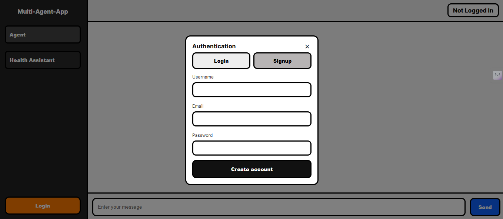
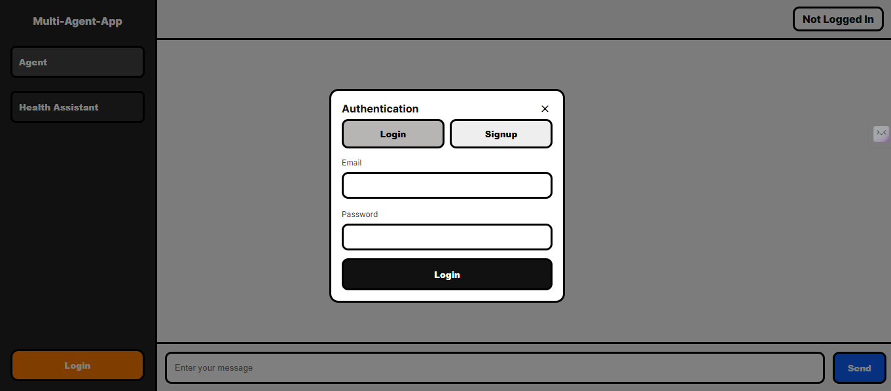
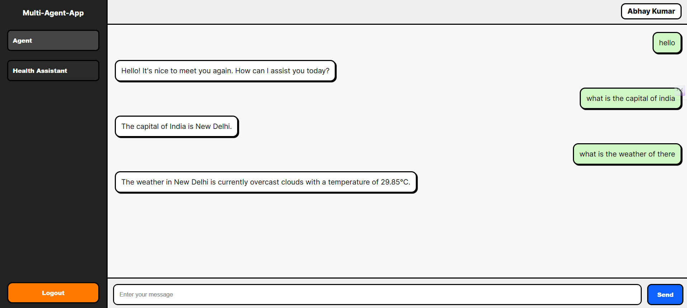
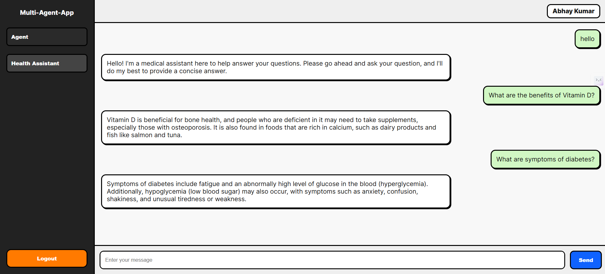

# AI Assistant

The AI Assistant is a full-stack application featuring two AI-powered agents:

* General AI Agent for natural conversations, web search, and API integration.

* Health Assistant powered by Retrieval-Augmented Generation (RAG) to answer health-related queries based on PDFs stored in Pinecone VectorDB.

It includes a secure JWT authentication system with user registration, login, and a frontend interface built with HTML/CSS/JS for seamless interactions.

## Features

* 🔐 Secure Authentication & Authorization

    - JWT-based login/logout, signup, and session handling.

    - Role-based protection for API routes.

* 🤖 AI Agents

    - General AI Agent for normal chat, weather updates, and web search (Groq LLM).

    - Health Assistant with RAG to answer medical queries based on indexed PDFs.

* 📂 PDF Document Ingestion

    - Load PDFs, embed using HuggingFace, and store vectors in Pinecone.

* 🌐 Web Search & API Integration

    - Integrated Tavily Search API and OpenWeather API for live data.

* 💾 Backend Tech

    - Built with FastAPI, MongoDB, Pinecone, and LangChain.

* 🖥️ Frontend UI

    - A modern, minimal HTML/JS frontend with sidebar navigation, authentication modals, and dynamic chat windows.


## Tech Stack

| Component       | Technology Used                    |
| --------------- | ---------------------------------- |
| Backend         | FastAPI, LangChain, Python         |
| Database        | MongoDB                            |
| Vector Database | Pinecone                           |
| LLM             | Groq (LLaMA-3-70B-8192)            |
| Frontend        | HTML, CSS, Vanilla JS              |
| Auth            | JWT with OAuth2PasswordBearer      |
| Others          | Tavily Search API, OpenWeather API |


## API Endpoints

| Method | Endpoint       | Description                      |
| ------ | -------------- | -------------------------------- |
| `POST` | `/auth/signup` | Register a new user              |
| `POST` | `/auth/login`  | Login & get JWT token            |
| `GET`  | `/auth/me`     | Get current logged-in user info  |
| `POST` | `/agent/chat`  | Chat with general AI agent       |
| `POST` | `/health/ask`  | Chat with Health Assistant (RAG) |
| `GET`  | `/user/all`    | Get all users                    |
| `GET`  | `/user/{id}`   | Get user by ID                   |
| `PUT`  | `/user/{id}`   | Update user by ID                |
| `DELETE`| `/user/{id}`   | Delete user by ID                | 


## Setup & Installation

Follow these steps to run the app locally:

### 1. Clone the repository
``` 
git clone https://github.com/yourusername/multi-agent-app.git
cd multi-agent-app
```

### 2. Create a virtual environment
```
python -m venv venv
source venv/bin/activate  # On Windows: venv\Scripts\activate
```

### 3. Install dependencies
```
pip install -r requirements.txt
```

### 4. Set up environment variables
```
cp .env.example .env
(Fill in your API keys for MongoDB, Pinecone, Groq, Tavily, OpenWeather)
```

### 5. Run the FastAPI server
```
uvicorn app.main:app --reload
```


## PDF Ingestion (For Health Assistant)
```
- Place PDFs in /data directory
- Run the ingestion script to index in Pinecone

python app/rag/ingest.py
```

## Frontend

A simple HTML/JS frontend is included:

* Sidebar with agent selection (General or Health).
* Login/Signup modal with token-based authentication.
* Chat UI with dynamic rendering.

To launch:
```
Open frontend/index.html in your browser
```

## Screenshots

### Login / Signup Modal



### General Agent Chat


### Health Assistant (RAG)



## Future Improvements

- 👤 A user profile page
- 🔄 Refresh token implementation
- 🧑‍⚕️ More advanced medical dataset integration
- 📱 Fully responsive frontend
- 🧩 Add more AI Agent (news, finance, etc.)


## License

This project is licensed under the MIT License - see the LICENSE
 file for details.